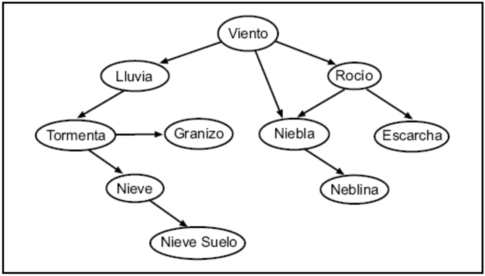

## David Montero Loaiza

Contenido a entregar: Responde a las preguntas planteadas y aporta el código en R utilizado para responderlas. Se debe enviar un único documento con texto y código entrelazado, bien sea en formato pdf o html.

Fecha de entrega: 7 Abril 2019

```{r}
require(bnlearn)
```


### Introducción a la práctica

Utilizaremos un conjunto de datos diarios de ocurrencia de meteoros en el aeropuerto de Parayas (Santander), considerando una serie de variables meteorológicas registradas diariamente durante un periodo aproximado de 10 años (3286 registros), en concreto: precipitación, nieve, granizo, tormenta, niebla, rocío, escarcha, nieve en el suelo, neblina y racha máxima de viento superior a 50 km/h. Los datos se encuentran guardados en el fichero de texto meteoro.txt. Las variables se encuentran discretizadas de forma binaria (ocurrencia/ausencia).

```{r}
meteoro = read.table('meteoro.txt',header = TRUE)
```

En este caso, y a través del asesoramiento de un meteorólogo, se ha elaborado el siguiente diagrama acíclico dirigido (DAG), que recoge las relaciones de dependencia entre las variables:



### Ejercicio 1 (2.5 Puntos)

A partir del grafo dado por el experto, determina la expresión que refleja la factorización de la distribución global, y escríbela como una secuencia de caracteres del tipo generado por la función modelstring del paquete de R bnlearn.

```{r}
expresion = "[viento][lluvia|viento][rocio|viento][tormenta|lluvia][niebla|rocio:viento][escarcha|rocio][nieve|tormenta][granizo|tormenta][neblina|niebla][nieveSuelo|nieve]"
```

NOTA: Como ya se comentado anteriormente, es importante evitar tildes a la hora de nombrar los nodos. Tampoco son recomendables espacios en blanco ni ningún tipo de carácter especial.

A continuación, introduce el DAG en R utilizando la definicíon del modelo que acabas de crear

```{r}
dag = model2network(expresion)
plot(dag)
```

Realiza una lista de los padres e hijos de cada uno de los nodos

```{r}
parentsDAG = lapply(X = names(meteoro),FUN = function(x) parents(dag,x))
childrenDAG = lapply(X = names(meteoro),FUN = function(x) children(dag,x))
names(parentsDAG) = names(meteoro)
names(childrenDAG) = names(meteoro)
```

```{r}
parentsDAG
```

```{r}
childrenDAG
```

Realiza una lista de todas las conexiones fundamentales presentes en el grafo, y realiza una clasificación de cada una de ellas determinando si es una estructura en serie, divergente o convergente.

1. Serie:
* Viento -> Lluvia -> Tormenta -> Nieve
* Lluvia -> Tormenta -> Nieve
* Tormenta -> Nieve -> NieveSuelo
* Lluvia -> Tormenta -> Granizo
* Viento -> Niebla -> Neblina
* Viento -> Rocio -> Niebla
* Viento -> Rocio -> Escarcha
* Rocio -> Niebla -> Neblina

2. Divergente:
* Lluvia <- Viento -> Niebla
* Lluvia <- Viento -> Rocio
* Niebla <- Viento -> Rocio
* Niebla <- Rocio -> Escarcha
* Lluvia <- Tormenta -> Granizo

3. Convergente:
* Viento -> Niebla <- Rocio

¿Se observa alguna v-estructura en el grafo?

Aunque existe una convergencia en Viento -> Niebla <- Rocio, no es una v-estructura ya que existe un arco Viento -> Rocio.

```{r}
vstructs(dag)
```

Intenta introducir un arco que parta del nodo neblina y se dirija hacia escarcha, y otro que vaya de granizo a lluvia. Comenta qué sucede en cada caso, y si el resultado daría lugar a una red bayesiana válida.

```{r}
dag = set.arc(dag,from = "neblina",to = "escarcha")
#dag = set.arc(dag,from = "granizo",to = "lluvia")
```

De neblina a escarcha se puede introducir un arco, mientras que de granizo a lluvia no porque el grafo debe ser acíclico.

Determina la manta de Markov del nodo rocio.

```{r}
mb(dag,"rocio")
```

Neblina entra en la manta de Markov ya que ahora comparte el hijo Escarcha con Rocio.

Introduce un arco que parta del nodo Lluvia y se dirija al nodo Niebla, ¿cambia la manta de Markov del nodo rocio? En caso afirmativo, ¿cómo lo hace?

```{r}
dag = set.arc(dag,from = "lluvia",to = "niebla")

mb(dag,"rocio")
```

Lluvia se introduce en la manta de Markov ya que comparte un hijo (Niebla) con Rocio.

Para continuar, elimina el arco definido anteriormente entre los nodos Lluvia y Niebla, recuperando el DAG original.

```{r}
dag = drop.arc(dag,from = "lluvia",to = "niebla")
dag = drop.arc(dag,from = "neblina",to = "escarcha")
```

### Ejercicio 2 (2.5 Puntos)

Considerando la información proporcionada por el conjunto de datos meteor, construye la red bayesiana utilizando el método bayesiano de estimación paramétrica.

```{r}
bn = bn.fit(dag, data = meteoro, method = "bayes")
```

¿Cuál sería el número potencial de parámetros (sin usar la red bayesiana) del modelo para calcular la probabilidad global si no utilizasemos el DAG?

```{r}
2^(ncol(meteoro)) - 1
```

¿Cuántos parámetros tiene la distribución global dada por la red bayesiana?

```{r}
nparams(bn)
```

Determina el número de parámetros asociado a cada una de las distribuciones locales

```{r}
for(i in nodes(dag)){
  params = length(as.vector(bn[[i]]$prob))
  print(paste("Parametros del nodo",i,"=",params))
}
```

Obtén las tablas de probabilidad condicional asociadas los nodos granizo y niebla. Ahora representa la información de cada tabla en sendos gráficos.

```{r}
bn$granizo
bn.fit.barchart(bn$granizo, main = "Granizo", xlab = "Pr(granizo|tormenta)", ylab = "Estado de Granizo")
```

```{r}
bn$niebla
bn.fit.barchart(bn$niebla, main = "Niebla", xlab = "Pr(niebla|viento,rocio)", ylab = "Estado de Niebla")
```

### Ejercicio 3 (2.5 Puntos)

Una vez construída la red hemos establecido la base de conocimiento del sistema inteligente. A continuación se puede calcular la probabilidad de cualquier variable o conjunto de variables condicionadas a cualquier evidencia que se tenga disponible para un problema dado, es decir, realizar la inferencia.

Observa la estructura del DAG y repasa la teoría y el concepto de d-separación. Responde razonadamente si las siguientes afirmaciones son verdaderas o falsas, utilizando únicamente la estructura del DAG y el concepto de d-separación:

La nieve y el granizo son fenómenos independientes a priori: Falso

Condición: *Vacío*
Nieve <- Tormenta -> Granizo: Nieve y granizo no están d-separados ya que no hay v-estructuras y Tormenta no tiene arcos convergentes pero no está en el conjunto condición (conjunto *vacío*).

```{r}
dsep(bn,"nieve","granizo")
```

La nieve y el granizo son fenómenos independientes dado que haya habido tormenta: Verdadero

Condición: *Tormenta*
Nieve <- *Tormenta* -> Granizo: Nieve y granizo están d-separados ya que *Tormenta* no tiene arcos convergentes y está en el conjunto condición (conjunto *Tormenta*).

```{r}
dsep(bn,"nieve","granizo","tormenta")
```

La nieve en el suelo y la neblina son fenómenos independientes: Falso

Condición: *Vacío*

NieveSuelo <- Nieve <- Tormenta <- Lluvia <- Viento -> Niebla -> Neblina: NieveSuelo y granizo no están d-separados ya que no hay v-estructuras y el nodo Viento no tiene arcos convergentes pero no está en el conjunto condición (conjunto *vacío*).

NieveSuelo <- Nieve <- Tormenta <- Lluvia <- Viento -> Rocio -> Niebla -> Neblina: NieveSuelo y granizo no están d-separados ya que no hay v-estructuras y el nodo Viento no tiene arcos convergentes pero no está en el conjunto condición (conjunto *vacío*).

```{r}
dsep(bn,"nieveSuelo","neblina")
```

La nieve en el suelo y la neblina son fenómenos independientes dado que haya habido tormenta: Verdadero

Condición: *Tormenta*

NieveSuelo <- Nieve <- *Tormenta* <- Lluvia <- Viento -> Niebla -> Neblina: NieveSuelo y granizo están d-separados ya que no hay v-estructuras y el nodo Viento no tiene arcos convergentes pero no está en el conjunto condición (conjunto *Tormenta*).

NieveSuelo <- Nieve <- *Tormenta* <- Lluvia <- Viento -> Rocio -> Niebla -> Neblina: NieveSuelo y granizo están d-separados ya que no hay v-estructuras y el nodo Viento no tiene arcos convergentes pero no está en el conjunto condición (conjunto *Tormenta*).

```{r}
dsep(bn,"nieveSuelo","neblina","tormenta")
```

NOTA: En este apartado se deberá aplicar la inferencia exacta. Conocido que en un día dado se han producido tormentas, calcula cómo afecta este hecho a la probabilidad de que se produzcan los siguientes fenómenos meteorológicos:

```{r}
require(gRain)
junction = compile(as.grain(bn))
tormenta.s = setEvidence(junction,nodes = "tormenta", states = "s")
```

Que llueva, P(lluvia=s|tormenta=s)

```{r}
querygrain(tormenta.s, nodes = "lluvia")$lluvia["s"]
```

Que haya rachas de viento superiores a 50 Km/h, P(viento=s|tormenta=s)

```{r}
querygrain(tormenta.s, nodes = "viento")$viento["s"]
```

Que llueva y que además las rachas de viento superen los 50 Km/h, P(lluvia=s,viento=s|tormenta=s) [en el enunciado original aparecía viento=n, dado el enunciado lo cambié por viento=s]

```{r}
querygrain(tormenta.s, nodes = c("lluvia","viento"),type = "joint")["s","s"]
```

A partir de la información revelada por la red bayesiana, sabiendo que un día se producen tormentas:

¿Hay mayor probabilidad de que llueva cuando se producen tormentas que cualquier otro día?

```{r}
tormenta.n = setEvidence(junction,nodes = "tormenta", states = "n")
querygrain(tormenta.n, nodes = "lluvia")$lluvia["s"]
```

Sí, hay mayor probabilidad de que llueva cuando se producen tormentas (0.91) que cuando no (0.52).

¿Aumenta o disminuye la probabilidad de tener rachas de viento mayores de 50 Km/h cuando se produce tormenta? ¿Cuánto?

```{r}
querygrain(tormenta.n, nodes = "viento")$viento["s"]
```

Aumenta la probabilidad de 0.13 a 0.21 de tener rachas de viento mayores de 50 Km/h cuando se produce una tormenta.

Dado el ejercicio anterior, repetir ahora el ejercicio mediante inferencia aproximada, calculando para cada una de las estimaciones 100 realizaciones. Para cada una de las respuestas anteriores, representa un diagrama de cajas que represente la dispersión en la estimación de la probabilidad, marcando además el valor obtenido de manera exacta en el apartado anterior:

Que llueva, P(lluvia=s|tormenta=s)

```{r}
inf.exacta = querygrain(tormenta.s, nodes = "lluvia")$lluvia["s"]
inf.aprox = NULL
for(i in 1:100) inf.aprox = c(inf.aprox,cpquery(bn,event = (lluvia == "s"),evidence = (tormenta == "s")))
boxplot(inf.aprox,main = "(P(lluvia=s|tormenta=s))")
abline(h = inf.exacta,col = "red")
legend("topleft",lty = 1,col = "red",legend = "Inferencia Exacta")
```

Que haya rachas de viento superiores a 50 Km/h, P(viento=s|tormenta=s)

```{r}
inf.exacta = querygrain(tormenta.s, nodes = "viento")$viento["s"]
inf.aprox = NULL
for(i in 1:100) inf.aprox = c(inf.aprox,cpquery(bn,event = (viento == "s"),evidence = (tormenta == "s")))
boxplot(inf.aprox,main = "(P(viento=s|tormenta=s))")
abline(h = inf.exacta,col = "red")
legend("topleft",lty = 1,col = "red",legend = "Inferencia Exacta")
```

Que llueva y que además las rachas de viento superen los 50 Km/h, P(lluvia=s,viento=s|tormenta=s) [en el enunciado original aparecía viento=n, dado el enunciado lo cambié por viento=s]

```{r}
inf.exacta = querygrain(tormenta.s, nodes = c("lluvia","viento"),type = "joint")["s","s"]
inf.aprox = NULL
for(i in 1:100) inf.aprox = c(inf.aprox,cpquery(bn,event = (lluvia == "s") & (viento == "s"),evidence = (tormenta == "s")))
boxplot(inf.aprox,main = "(P(lluvia=s,viento=s|tormenta=s))")
abline(h = inf.exacta,col = "red")
legend("topleft",lty = 1,col = "red",legend = "Inferencia Exacta")
```

¿Hay mayor probabilidad de que llueva cuando se producen tormentas que cualquier otro día?

```{r}
inf.exacta.n = querygrain(tormenta.n, nodes = "lluvia")$lluvia["s"]
inf.exacta.s = querygrain(tormenta.s, nodes = "lluvia")$lluvia["s"]

inf.aprox.n = NULL
inf.aprox.s = NULL

for(i in 1:100){
  inf.aprox.s = c(inf.aprox.s,cpquery(bn,event = (lluvia == "s"),evidence = (tormenta == "s")))
  inf.aprox.n = c(inf.aprox.n,cpquery(bn,event = (lluvia == "s"),evidence = (tormenta == "n")))
}

par(mfrow = c(1,2))

boxplot(inf.aprox.n,main = "(P(lluvia=s|tormenta=n))",ylim = c(0,1))
abline(h = inf.exacta.n,col = "red")
legend("topleft",lty = 1,col = "red",legend = "Inferencia Exacta")

boxplot(inf.aprox.s,main = "(P(lluvia=s|tormenta=s))",ylim = c(0,1))
abline(h = inf.exacta.s,col = "blue")
legend("bottomleft",lty = 1,col = "blue",legend = "Inferencia Exacta")
```

Sí existe una mayor probabilidad de que llueva cuando hay tormentas.

¿Aumenta o disminuye la probabilidad de tener rachas de viento mayores de 50 Km/h cuando se produce tormenta? ¿Cuánto?

```{r}
inf.exacta.n = querygrain(tormenta.n, nodes = "viento")$viento["s"]
inf.exacta.s = querygrain(tormenta.s, nodes = "viento")$viento["s"]

inf.aprox.n = NULL
inf.aprox.s = NULL

for(i in 1:100){
  inf.aprox.s = c(inf.aprox.s,cpquery(bn,event = (viento == "s"),evidence = (tormenta == "s")))
  inf.aprox.n = c(inf.aprox.n,cpquery(bn,event = (viento == "s"),evidence = (tormenta == "n")))
}

par(mfrow = c(1,2))

boxplot(inf.aprox.n,main = "(P(viento=s|tormenta=n))",ylim = c(0,1))
abline(h = inf.exacta.n,col = "red")
legend("topleft",lty = 1,col = "red",legend = "Inferencia Exacta")

boxplot(inf.aprox.s,main = "(P(viento=s|tormenta=s))",ylim = c(0,1))
abline(h = inf.exacta.s,col = "blue")
legend("topleft",lty = 1,col = "blue",legend = "Inferencia Exacta")
```

Aumenta la probabilidad, sin embargo, para inferencias aproximadas, es necesario realizar varias pruebas para acercarnos más a un valor estimado.

### Ejercicio 4 (2.5 Puntos)

Como hemos visto, es posible realizar un aprendizaje automático de la estructura del DAG a partir de los datos, usando algoritmos específicos para ello. Durante las clases hemos visto el ejemplo del algoritmo hill-climbing, aunque como vimos, hay otras posibilidades. Tambien hemos visto que podemos combinar nuestra experiencia y el aprendizaje automático definiendo previamente relaciones entre variables que queremos introducir o descartar en el DAG resultante. Además, se ha explicado que existen scores que sirven como criterio para evaluar la fuerza de la dependendencia entre nodos de la red y comparar la bondad de ajuste del modelo.

Evalúa la significación de los arcos dibujados por el experto en el actual DAG utilizando el estadístico χ2. ¿Hay algún arco no significativo? 

```{r}
strength = arc.strength(dag, data = meteoro, criterion = "x2")
strength
```

No hay arcos que no sean significativos a un nivel de confianza del 95%.

¿Cuáles son los tres pares de nodos que presentan un arco de unión más fuerte?

```{r}
head(strength[order(strength$strength),],3)
```

Además del algoritmo hill-climbing, existe otro algoritmo popular de tipo “voraz” denominado Tabu search. En bnlearn se encuentra implementado a traves de la función tabu, y los argumentos de entrada son similares a los vistos para hill-climbing.

Compara el score global (BIC) obtenido por el DAG inicial, con los obtenidos por los DAG aprendidos de forma automática con los algoritmos tabu y hill-climbing. ¿Cuál obtiene mejor score?

```{r}
bic.dag.inicial = score(dag,data = meteoro)

dag.hc = model2network(modelstring(hc(meteoro)))
dag.tabu = model2network(modelstring(tabu(meteoro)))

bic.dag.hc = score(dag.hc,data = meteoro)
bic.dag.tabu = score(dag.tabu,data = meteoro)

bics = c(bic.dag.inicial,bic.dag.hc,bic.dag.tabu)
names(bics) = c("Inicial","HC","Tabu")
bics
```

El método de Tabu obtiene el mejor BIC.

Ahora, para comparar el DAG original con los dos nuevos DAG tabu y hill-climbing, dibuja los tres utilizando la función graphviz.plot. A la luz de los grafos obtenidos en cada caso, ¿cuál te parece que recoge mejor las relaciones causa-efecto entre variables?. Hay que tener en cuenta que los arcos de un grafo no expresan causalidad, sino simplemente dependencia entre variables en términos de probabilidad.

```{r}
graphviz.compare(dag,dag.hc,dag.tabu)
```

Aunque los métodos de aprendizaje automático agregan relaciones que pueden ser adecuadas, existen también relaciones como granizo -> rocio (dado por Hill-climbing), que aunque indiquen una dependencia, que pueda no ser muy alta, no aportan a una relación causa-efecto significativa.

En este ejemplo podemos apreciar la probabilidad de que exista rocio dado que hubo granizo:

```{r}
bn.test = bn.fit(dag.hc, data = meteoro, method = "bayes")
junction.test = compile(as.grain(bn.test))

granizo.s = setEvidence(junction.test,nodes = "granizo", states = "s")
granizo.n = setEvidence(junction.test,nodes = "granizo", states = "n")

inf.exacta.rocio.s = querygrain(granizo.s,nodes = "rocio")$rocio["s"]
inf.exacta.rocio.n = querygrain(granizo.n,nodes = "rocio")$rocio["s"]

paste("P(rocio=s|granizo=s) =",inf.exacta.rocio.s,", P(rocio=s|granizo=n) =",inf.exacta.rocio.n)
```

Ambas probabilidades no son muy altas, aunque haya una diferencia de aproximadamente 10 unidades porcentuales entre ellas, por lo tanto, no es estrictamente necesario que el granizo cause el rocío todo el tiempo (como se acaba de ver), cuando es mucho más probable de que sea la lluvia el que lo cause. En este tipo de casos hace falta un aporte experto para manejar los arcos dirigidos de los grafos. Definir qué arcos deben ir y qué arcos no deben ir y hacia donde dirigirlos es algo que un experto puede definir a priori para evitar este tipo de casos.

Ahora vuelve a aprender de forma automática el DAG usando tabu y hill-climbing, pero imponiendo las siguientes restricciones: 1. Los arcos viento --> lluvia, tormenta --> granizo y nieve --> nieveSuelo deben quedar reflejados en el DAG. 2. Ningún arco debe unir directamente la neblina con el granizo ni la niebla con la tormenta.

```{r}
df.whiteList = data.frame(from = c("viento","tormenta","nieve"),
                          to = c("lluvia","granizo","nieveSuelo"))

df.blackList = data.frame(from = c("neblina","niebla"),
                          to = c("granizo","tormenta"))

dag.hc = model2network(modelstring(hc(meteoro,whitelist = df.whiteList,blacklist = df.blackList)))
dag.tabu = model2network(modelstring(tabu(meteoro,whitelist = df.whiteList,blacklist = df.blackList)))
```

Vuelve a dibujar los DAG resultantes, y a partir del BIC obtenido por cada modelo, determina cuál es el mejor de todos poniéndolos en una tabla.

```{r}
graphviz.compare(dag,dag.hc,dag.tabu)
```

```{r}
bic.dag.hc = score(dag.hc,data = meteoro)
bic.dag.tabu = score(dag.tabu,data = meteoro)

bics = c(bic.dag.inicial,bic.dag.hc,bic.dag.tabu)
names(bics) = c("Inicial","HC","Tabu")
bics
```

Los DAG de HC y Tabu son mejores teniendo en cuenta las restricciones dadas (tienen el mismo valor de BIC).

Computa la fuerza de la relación entre nodos de los dos últimos modelos que combinan nuestra experiencia con el aprendizaje automático.

```{r}
strength = arc.strength(dag.hc, data = meteoro, criterion = "x2")
strength
```

Para el método de Hill-climbing no hay arcos que no sean significativos a un nivel de confianza del 95%.

```{r}
head(strength[order(strength$strength),],3)
```

Los nodos con más fuerza ahora son nieve -> nieveSuelo, lluvia -> rocio y tormenta -> granizo.

```{r}
strength = arc.strength(dag.tabu, data = meteoro, criterion = "x2")
strength
```

Para el método de Tabu no hay arcos que no sean significativos a un nivel de confianza del 95%.

```{r}
head(strength[order(strength$strength),],3)
```

Los nodos con más fuerza son los mismos que para el método de Hill-climbing.

Comenta brevemente los resultados obtenidos tras combinar nuestro conocimiento con el aprendizaje automático.

Al combinar el conocimiento anterior con el aprendizaje automático logra obtenerse ligeramente un mejor resultado que al realizar únicamente el aprendizaje automático y que utilizar el conocimiento anterior. Esto puede reflejarse en los valores obtenidos por los BIC de los métodos Hill-climbing y Tabu sin utilizar restricciones y los mismos utilizando restricciones, que mejoran un poco asignando relaciones dadas según un experto.